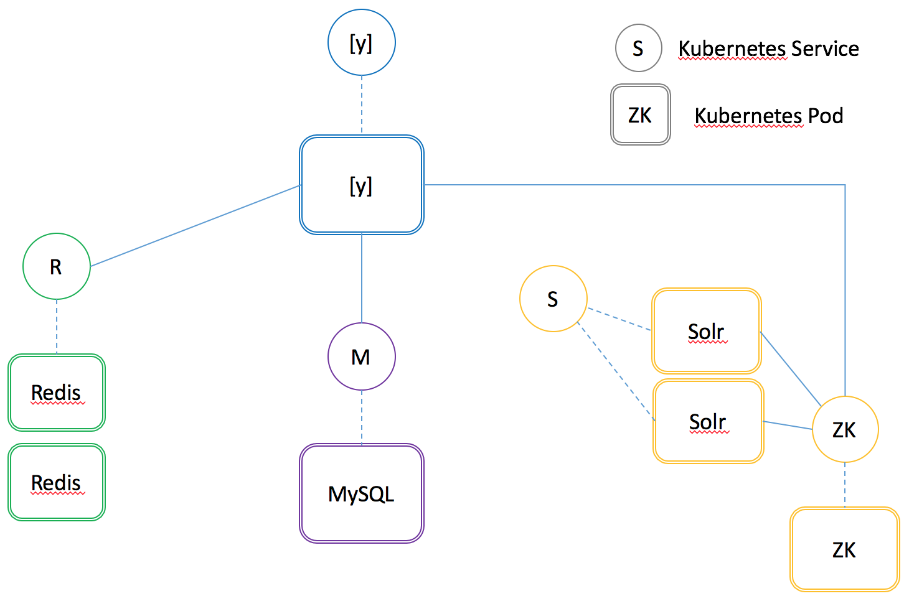

#Dockerize hybris components and orchestrate with Kubernetes

https://wiki.hybris.com/display/~winston.zhang@hybris.com/Dockerize+hybris+and+orchestrate+with+Kubernetes

#Motivation

containerize hybris components

auto-scale

auto-heal

auto provision on bare metal and cloud providers

resource orchestration

immutable infrastructure


#Preparation
##software
    hybris 5.6
    solr 5.2.1
    zookeeper 3.4.6
    mysql 5.6.26
    docker 1.7.1
    gentoo linux latest
    etcd 2.1.1
    kubernetes 1.0.1

##environment



#Dockerize hybris components
https://github.com/colorzhang/docker

    Dockerize
    based on Open JDK 8
    Optimize
    minimize steps
    non-root user
    ports

    Parameterise
    TODO

    Final Dockfile
    Further improvement

```bash
winston@gentoo ~ $ docker images
REPOSITORY                         TAG                 IMAGE ID            CREATED             VIRTUAL SIZE
winston/hybris                     5.6                 0117e362783a        3 hours ago         5.469 GB
winston/hybris                     5.6-base            9845bb327b4f        3 hours ago         5.001 GB
winston/openjdk                    8                   0d0745a44a63        3 hours ago         186.9 MB
winston/solr                       5.2.1               69e78d29cc1e        8 hours ago         734.5 MB
apache/zookeeper                   latest              dc12e0467f49        8 hours ago         238.7 MB
winston/java                       8                   ae620d1bcac7        11 hours ago        180.5 MB
mysql                              5.6                 a1798df89390        44 hours ago        283.8 MB
java                               8                   2f5a61e35ea4        9 days ago          817.5 MB
java                               openjdk-8-jdk       2f5a61e35ea4        9 days ago          817.5 MB
debian                             wheezy              bbe78c1a5a53        9 days ago          84.95 MB
gcr.io/google_containers/kube-ui   v1.1                c144d89158dc        7 weeks ago         5.83 MB
centos                             latest              7322fbe74aa5        10 weeks ago        172.2 MB
alpine                             latest              31f630c65071        11 weeks ago        5.25 MB
gcr.io/google_containers/pause     0.8.0               6c4579af347b        13 months ago       239.8 kB
kubernetes/pause                   latest              6c4579af347b        13 months ago       239.8 kB
```

#Verify with docker command
##build image
    docker build -t winston/hybris:5.6 .
##run
    docker run -it --name=hybris -p 9001:9001 -p 9002:9002 -p 8000:8000 winston/hybris:5.6
    
#Kubernetes up & running

##build
```bash
git clone https://github.com/kubernetes/kubernetes
cd kubernetes
make
cp _output/local/bin/linux/amd64/kube* /usr/bin
```

##run kubernetes
```bash
/etc/init.d/etcd start

/etc/init.d/docker start

kube-apiserver --allow-privileged --insecure-bind-address=0.0.0.0 --insecure-port=8080 --service-cluster-ip-range=10.0.0.0/16 --etcd_servers=http://localhost:4001 --admission_control=NamespaceLifecycle,LimitRanger,ResourceQuota >/var/log/kube/kube-apiserver.log 2>&1 &

kube-controller-manager --master=http://localhost:8080 >/var/log/kube/kube-controller-manager.log 2>&1 &

kube-scheduler --master=http://localhost:8080 >/var/log/kube/kube-scheduler.log 2>&1 &

kube-proxy --master=http://localhost:8080 --legacy-userspace-proxy=false --v=1 >/var/log/kube/kube-proxy.log 2>&1 &

kubelet --allow-privileged --api_servers=http://localhost:8080 --v=1 >/var/log/kube/kubelet.log 2>&1 &
```
:warning::warning::warning: kube-proxy eats too much cpu if use userspace proxy under heavy load. pls use to-be-released iptables proxy in 1.1. see issue https://github.com/kubernetes/kubernetes/issues/13270 

##run hybris components
```bash
kubectl create -f zk-service.yaml
kubectl create -f solr-service.yaml
kubectl create -f mysql-service.yaml
kubectl create -f hybris56-service.yaml

kubectl create -f zk-rc.yaml
kubectl create -f solr-rc.yaml
kubectl create -f mysql-rc.yaml
kubectl create -f hybris56-rc.yaml
```

##Verify
```bash
gentoo ~ # kubectl get po
NAME                         READY     STATUS    RESTARTS   AGE
hybris56-controller-9p5su    1/1       Running   0          3h
mysql-controller-o9wof       1/1       Running   0          8h
solrcloud-controller-sklrt   1/1       Running   0          8h
solrcloud-controller-tshs7   1/1       Running   0          8h
zk-controller-yt97k          1/1       Running   0          8h

gentoo ~ # kubectl get svc
NAME               CLUSTER_IP     EXTERNAL_IP   PORT(S)                      SELECTOR        AGE
hybris56-service   10.0.159.218   <none>        9001/TCP,9002/TCP,8000/TCP   app=hybris56    23d
kubernetes         10.0.0.1       <none>        443/TCP                      <none>          29d
mysql-service      10.0.199.144   <none>        3306/TCP                     app=mysql       2d
solr-service       10.0.162.73    <none>        8983/TCP                     app=solrcloud   2d
zk-service         10.0.108.253   <none>        2181/TCP                     app=zookeeper   20d

gentoo ~ # kubectl get rc
CONTROLLER             CONTAINER(S)   IMAGE(S)             SELECTOR        REPLICAS   AGE
hybris56-controller    hybris56       winston/hybris:5.6   app=hybris56    1          3h
mysql-controller       mysql          mysql:5.6            app=mysql       1          8h
solrcloud-controller   solrcloud      winston/solr:5.2.1   app=solrcloud   2          8h
zk-controller          zookeeper      apache/zookeeper     app=zookeeper   1          8h

gentoo ~ # kubectl get ep
NAME               ENDPOINTS                                               AGE
hybris56-service   172.17.0.112:9002,172.17.0.112:9001,172.17.0.112:8000   23d
kubernetes         10.0.2.15:6443                                          29d
mysql-service      172.17.0.43:3306                                        2d
solr-service       172.17.0.66:8983,172.17.0.67:8983                       2d
zk-service         172.17.0.62:2181                                        20d
```

```bash
gentoo ~ # pstree 
init-+-6*[agetty]
     |-docker-+-3*[exe---3*[{exe}]]
     |        |-java---26*[{java}]
     |        |-kube-ui---3*[{kube-ui}]
     |        |-mysqld---52*[{mysqld}]
     |        |-3*[pause---3*[{pause}]]
     |        |-3*[pause---4*[{pause}]]
     |        |-start.sh---bash---java---45*[{java}]
     |        |-start.sh---bash---java---53*[{java}]
     |        |-wrapper.sh---wrapper-linux-x-+-java---188*[{java}]
     |        |                              `-{wrapper-linux-x}
     |        `-57*[{docker}]
     |-etcd---8*[{etcd}]
     |-kube-apiserver---17*[{kube-apiserver}]
     |-kube-controller---16*[{kube-controller}]
     |-kube-proxy---17*[{kube-proxy}]
     |-kube-scheduler---15*[{kube-scheduler}]
     |-kubelet---19*[{kubelet}]
     |-sshd-+-sshd---bash
     |      |-sshd---bash---pstree
     |      `-2*[sshd---sshd---bash]
     `-systemd-udevd
```

#Scale in & out
Scale out SolrCloud to 4 replicas
```bash
kubectl scale --replicas=4 replicationcontrollers solrcloud-controller
```

Scale out hybris to 2 nodes
```bash
kubectl scale --replicas=2 replicationcontrollers hybris56-controller
```

#Orchestrate more components

    dockerize nginx
    dockerize ELK
    dockerize redis

#Further improvements

    automate with Ansible
    multi-nodes kubernetes cluster
    monitoring
    security
    overlay network (Flannel)

Happy containerizing!

Winston Zhang (colorzhang@gmail.com)

August 2015
